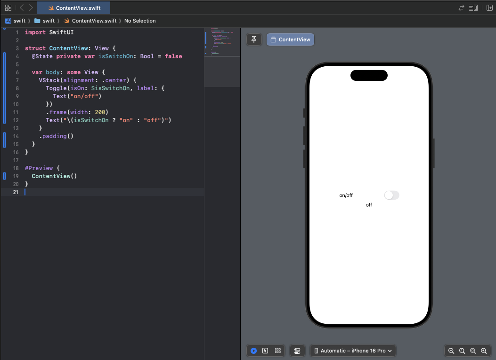

[TOC]

# SwiftUI 개요

## 개요

- 2019년 애플의 WWDC에서 처음 소개 된 SwiftUI는 모든 애플 운영체계용 앱을 개발하는 데 있어서 완전히 새로운 방법을 제공
- Xcode 개발 과정에서도 앱의 **라이브 프리뷰**(Live Preview) 기능을 이용하여 SwiftUI 프로젝트를 실시간으로 테스트 가능
- Swift의 수많은 장점은 **선언적 구문**(Declarative Syntax)과 **데이터 주도**(Data Driven) 기반에서 비롯되며, 이번 장에서 설명 할 핵심 주제임

## [SwiftUI](https://developer.apple.com/documentation/swiftui) vs [UIKit](https://developer.apple.com/documentation/uikit/)

* UIKit은 세밀한 UI 컨트롤과 다양한 기능을 제공하여, 개발자가 복잡한 UI를 정교하게 구현할 수 있음
  * 하지만, UIKit은 명령형 프로그래밍 패러다임을 사용하여 복잡한 코드를 작성해야 하며, SwiftUI에 비해 개발 속도가 느릴 수 있음
* SwiftUI와 UIKit의 선택은 프로젝트의 요구 사항, 팀의 경험 및 지원하는 iOS 버전에 따라 달라짐
  * SwiftUI는 개발 속도를 가속화하고, 코드의 간결성을 추구하는 프로젝트에 적합할 수 있으며, 특히 크로스 플랫폼 개발이 필요한 경우 유용함
  * 구버전 iOS를 지원해야 하거나 복잡한 UI의 구현이 필요한 경우 UIKit이 더 나은 선택일 수 있음

```swift
struct ContentView: View {
    var body: some View {
        VStack {
            Image(systemName: "globe")
                .imageScale(.large)
                .foregroundStyle(.tint)
            Text("Hello, world!")
        }
        .padding()
    }
}

#Preview {
    ContentView()
}
```

```swift
import UIKit

class ViewController: UIViewController {
    override func viewDidLoad() {
        super.viewDidLoad()
        let label = UILabel()
        label.text = "Hello, world!"
        label.frame = CGRect(x: 100, y: 100, width: 200, height: 20)
        view.addSubview(label)
    }
}
```


## SwiftUI의 선언적 구문과 데이터 주도의 의미

* SwiftUI는 기존 방식(UIKit + Interface Builder)과는 다른 방법을 도입
  * UI의 렌더링을 직접 구현하는 것이 아닌, 선언적 구문을 통해 UI를 선언하는 방식으로 진행
  * 데이터의 변화가 앱의 동작과 모양을 주도한다는 점에서 데이터 주도적. 즉, 특정 변수가 UI에 영향을 주는 경우에 데이터가 변함에 따라 UI에 표현되는 내용이 알아서 달라지는 것을 의미.

### @State

* @State는 데이터 주도적인 개발을 위한 프로퍼티 래퍼임
  * 프로퍼티에 붙여서 뷰의 현 상황을 저장하려고 할 때 사용
  * 프로퍼티와 뷰를 묶었다고 해서, 이걸 Binding 이라고 표현
    * 변수가 바뀜 → 뷰가 바뀐다는 의미로 해당 프로퍼티가 변경되는 이름 참조하는 뷰는 최신값을 반영하도록 업데이트 된다는 의미로 생각하면 됨
  * Swift Docs에서 [@State](https://developer.apple.com/documentation/swiftui/state#overview)
    * **Use state as the single source of truth for a given value type that you store in a view hierarchy.**
       

### 실습

#### 실습 준비

- iOS 장비의 **Developer Mode** 를 **On**으로 변경 후 **Restart**
   

   Team을 지정
   

- **Xcode** 실행 후 **Create New Project...** 클릭
   
- **Application** 에서 **App**을 선택 한 후 **Next** 클릭
   
- **Product Name**에는 원하는 이름을 입력하고, **Organization Identifier** 역시 아무거나 입력이 가능하다고는 하지만, [Apple Xcode Docs](https://developer.apple.com/documentation/xcode/creating-an-xcode-project-for-an-app#Create-a-project) 에서는 Java와 유사한 구조를 제안
   
- 원하는 경로에 프로젝트를 생성
   
- 생성 후 첫 화면 (느림...느리다...느려..)
   
- 왼쪽 패널에 다양한 옵션 메뉴들...

            
   
- iOS Device에서 실행 할 때는 **VPN & Device Management**에서 **DEVELOPER APP**에 자신의 개발자 인증서를 **Trust** 해줘야 함

     
   
   <div align="center"></div>

에러 발생 시 Debug Navigator에서 분석에 필요한 다양한 프로파일링이 가능


#### 실습

선언은 변수를 저장할 때 맨 앞에 @State를 붙이면 됩니다. 불러올때는 변수명 앞에 $를 붙이면 됩니다.

```swift
// 선언
@State private var name: String = "이형문"

// 호출
Text("\($name)")
```

선언적 구문과 데이터 주도 예제

```swift
import SwiftUI

struct ContentView: View {
  @State private var isSwitchOn: Bool = false
  
  var body: some View {
    VStack(alignment: .center) {
      Toggle(isOn: $isSwitchOn, label: {
        Text("on/off")
      })
      .frame(width: 200)
      Text("\(isSwitchOn ? "on" : "off")")
    }
    .padding()
  }
}

// Macro Preview
#Preview {
  ContentView()
}

// SwiftUI Multiple Device Preview
struct ContentView_Previews: PreviewProvider {
    static var previews: some View {
        ContentView()
            .previewDevice(PreviewDevice(rawValue: "iPhone 16 Pro"))
            .previewDisplayName("iPhone 16 Pro")

        ContentView()
            .previewDevice(PreviewDevice(rawValue: "iPhone 16 Pro Max"))
            .previewDisplayName("iPhone 16 Pro Max")
    }
}
```

**SwiftUI 모드의 Xcode** 실행 화면 - On/Off Toggle 버튼에 따라 Text 값이 변경 됨


라이브러리 패널(Library Panel)에서 원하는 항목을 찾아 Drag 하여 추가도 가능 (여기서는 Date Picker를 추가)


에디터의 항목을 선택하고 어트리뷰트 인스펙터를 클릭하면 해당 항목의 여러가지 랜더링 옵션을 조정할 수 있음


#### 앱 실행 방법

1. Live Preview
2. 시뮬레이터
3. 실제 iOS 디바이스

=

네트워크 테스트 활성화 (책하고 메뉴 스타일이 바뀜)


사용자 인터페이스 레이아웃 계층 구조

* 시뮬레이터 또는 Device에서 실행할 때 나온다고 책에 설명되어 있으나 안보임...
  