[TOC]

# SwiftUI 아키텍처

## SwiftUI 앱 계층 구조

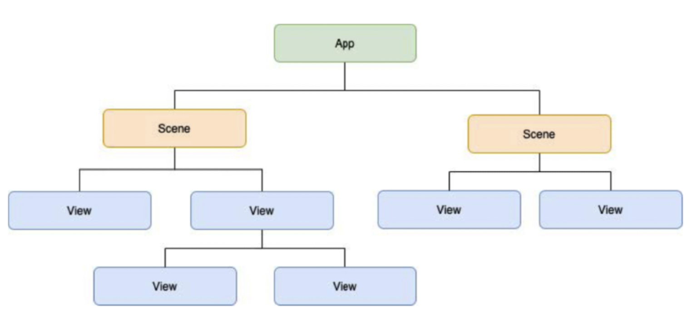

## App

* App 객체는 SwiftUI 애플리케이션 구조 내 최상위 요소
* 애플리케이션의 실행 중인 각 인스턴스의 시작 및 생명 주기를 처리
* 애플리케이션의 사용자 인터페이스를 구성하는 다양한 Scene을 관리하는 역할
* 애플리케이션에는 하나의 App 인스턴스만 포함

## Scene

* 각 SwiftUI 애플리케이션에는 하나 이상의 Scene이 포함
* Scene은 애플레케이션 사용자 인터페이스의 섹션 또는 영역을 나타냄
* iOS/watchOS에서 Scene은 일반적으로 전체 장치 화면을 차지하는 창 형태를 취함
* 반면, macOS/iPadOS 에서는 여러 Scene으로 구성될 가능성이 높음

## View

* View는 버튼, 레이블, 그리고 텍스트 필드와 같은 사용자 인터페이스의 시각적 요소를 구성하는 기본적인 빌딩 블록
* VStack, HStack, ZStack 처럼 다른 View를 관리하는 컨테이너도 포함
  * VStack: 수직으로 정렬된 뷰의 컨테이너
  * HStack: 수평으로 정렬된 뷰의 컨테이너
  * ZStack: 겹쳐진 뷰의 컨테이너

# 실습

* 앞 써 생성한 swift Product를 기반으로 설명

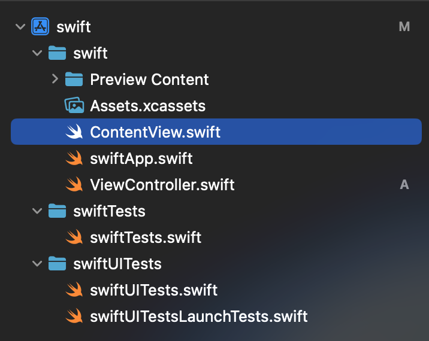

## App

* 안드로이드의 Application 클래스와 동일하게 앱의 진입점을 나타냄.
* @main을 선언부에 붙임으로써 앱의 진입점임을 SwiftUI에 알려주는 역할

```swift
import SwiftUI

@main
struct swiftApp: App {
    var body: some Scene {
        WindowGroup {
            ContentView()
        }
    }
}
```

## ContextView

```swift
import SwiftUI

struct ContentView: View {
    var body: some View {
        VStack {
            Image(systemName: "globe")
                .imageScale(.large)
                .foregroundStyle(.tint)
            Text("Hello, world!")
        }
        .padding()
    }
}
```

## Assets.scassets

Assets.scassets 폴더에는 이미지, 아이콘 및 색상과 같이 앱에서 사용하는 리소스를 저장하는데 사용되는 Asset 카탈로그가 포함

## swift.entitlements

* 앱 내에서 특정 IOS 기능에 대한 지원을 활성화하는 데 사용
* 앱에서 iCloud, 마이크 등에 접근해야 할 때 이 파일 내에서 이러한 권한을 먼저 활성화해야 함

## Preview Content

* Preview Asset 폴더에는 개발 중에 앱을 미리 볼 때 필요하지만 완성된 앱에서는 필요하지 않은 자산 밑 데이터가 포함
* 나중에 App을 패키징 할때는 불필요한 공간을 차지하지 않도록 아카이브에서 제거해야 함

## SwiftUI Custom View 생성하기

* SwiftUI에서 뷰는 View 프로토콜을 따르는 구조체로 선언
* View 프로토콜을 따르도록 하기 위해서 구조체는 body 프로퍼티를 가지고 있어야 하며, 이 body 프로퍼티 안에 뷰가 선언되어야 함

## View 추가하기

body 프로퍼티에 원하는 뷰를 배치하여 다른 뷰가 추가될 수 있지만 body 프로퍼티는 단 하나의 뷰를 반환하도록 구성되어 있음

```swift
import SwiftUI

struct ContentView: View {
    var body: some View {
        VStack {
            Image(systemName: "globe")
                .imageScale(.large)
                .foregroundStyle(.tint)
            Text("Hello, world!")
        }
        Text("Goodbye, world!")
    }
}

#Preview {
    ContentView()
}
```

책에서는 VStack 컨테이너 밖에 View를 추가하면 ***Goodbye, world!*** Text View만 포함하는 미리보기만 생성된다고 하였으나, 실제로 해보면 두개 다 생성 됨

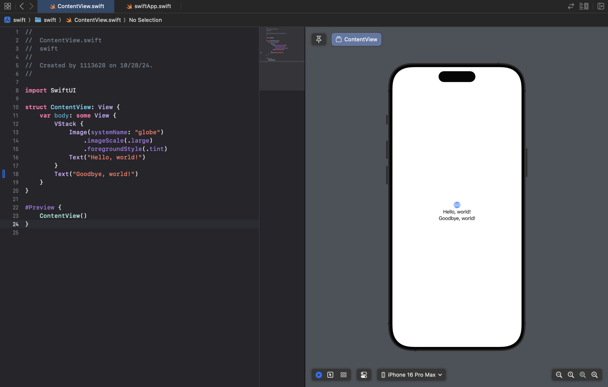

Swift 뷰는 기본적으로 부모 View와 자식 View 형태의 계층 구조를 가질 수 있음

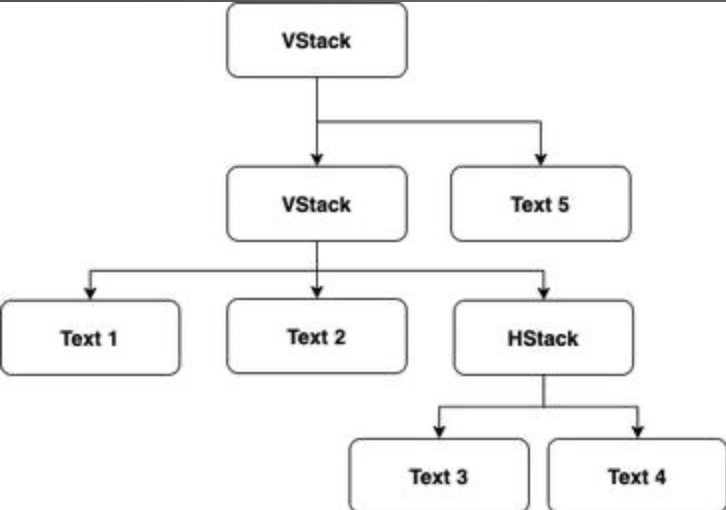

위 계층 구조를 코드로 표하면 다음과 같음

```swift
import SwiftUI

struct ContentView: View {
    var body: some View {
        VStack {
            VStack {
                Text("Text 1")
                Text("Text 2")
                HStack {
                    Text("Text 3")
                    Text("Text 4")
                }
            }
            Text("Text 5")
        }
        .padding()
    }
}

#Preview {
    ContentView()
}
```

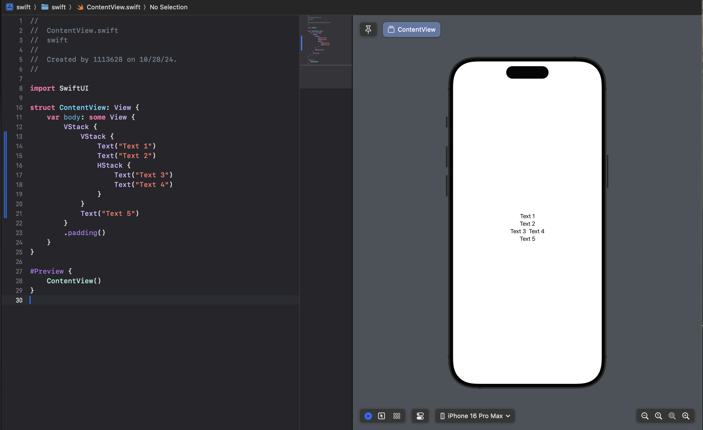

컨테이너에 포함 된 여러 View를 연결하면 하나의 View처럼 간주

```swift
import SwiftUI

struct ContentView: View {
    var body: some View {
        Text("Hello, ") + Text("how ") + Text("are you?")
    }
}

#Preview {
    ContentView()
}
```

여기서는 body 프로퍼티의 클로저(closure)는 반환(return) 구문이 없음

* 단일 표현식으로 되어 있기 때문이며, 암묵적 반환에 대해서는 9장 '**스위프트 함수, 메서드, 클로저**' 에서 설명 했음

하지만, 콜로저에 별도의 표현식이 추가되면 return 구문을 추가해야 함

```swift
import SwiftUI

struct ContentView: View {
    
    @State var fileopen: Bool = true
    
    var body: some View {
        var myString: String = "File closed"
        
        if (fileopen) {
            myString = "File open"
        }
        
        return VStack {
            HStack {
                Text(myString)
                    .padding()
                Text("Goodbye, world!")
            }
        }
    }
}

#Preview {
    ContentView()
}
```

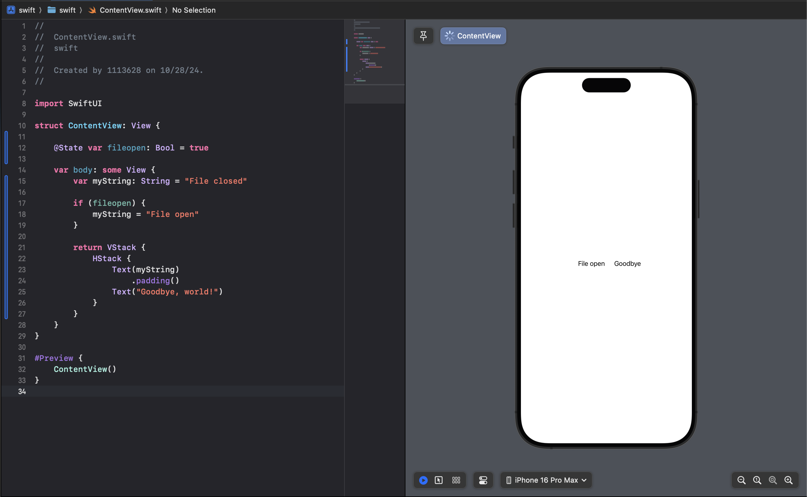

## 하위 View로 작업

* 애플은 최대한 뷰를 작고 가볍게 하라고 권장
* 재사용할 수 있는 컴포넌트 생성을 권장하고 레이아웃이 더 효율적으로 렌더링되도록 해야 함

```swift
import SwiftUI

struct ContentView: View {
    var body: some View {
        VStack {
            Image(systemName: "globe")
                .imageScale(.large)
                .foregroundStyle(.tint)
            Text("Hello, world!")
            Text("Goodbye World")
            MyHStackView()
        }
        .padding()
    }
}

struct MyHStackView: View {
    var body: some View {
        HStack {
            Text("Custom ")
            Text("View")
        }
    }
}

#Preview {
    ContentView()
}
```

위 예제에서는 메인 View가 **MyHStackView**라는 하위 뷰를 갖음


## 프로포티로서의 View

하위 View를 생성하는 것 이외에도 프로퍼티 View에 할당할 수도 있음

```swift
import SwiftUI

struct ContentView: View {
    var body: some View {
        VStack {
            Image(systemName: "globe")
                .imageScale(.large)
                .foregroundStyle(.tint)
            Text("Main Title")
                .font(.largeTitle)
            HStack {
                Text("Car Image")
                Image(systemName: "car.fill")
            }
        }
        .padding()
    }
}

#Preview {
    ContentView()
}
```

선언부 중 일부는 프로퍼티 값으로 이동하고 이름으로 참조되게 할 수도 있음

```swift
import SwiftUI

struct ContentView: View {
    
    let carStack = HStack {
        Text("Car Image")
        Image(systemName: "car.fill")
    }
    var body: some View {
        VStack {
            Image(systemName: "globe")
                .imageScale(.large)
                .foregroundStyle(.tint)
            Text("Main Title")
                .font(.largeTitle)
            carStack
        }
        .padding()
    }
}

#Preview {
    ContentView()
}
```

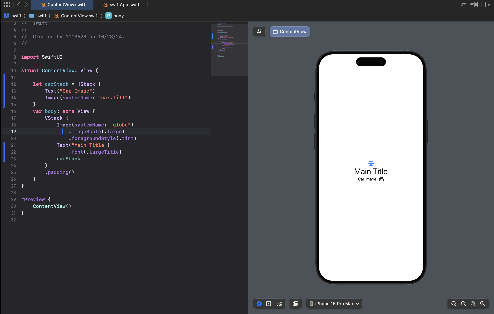

## View 변경하기

모든 SwiftUI View에는 View의 모양과 동작을 변경하는 데 사용하는 수정자(modifier)가 있음

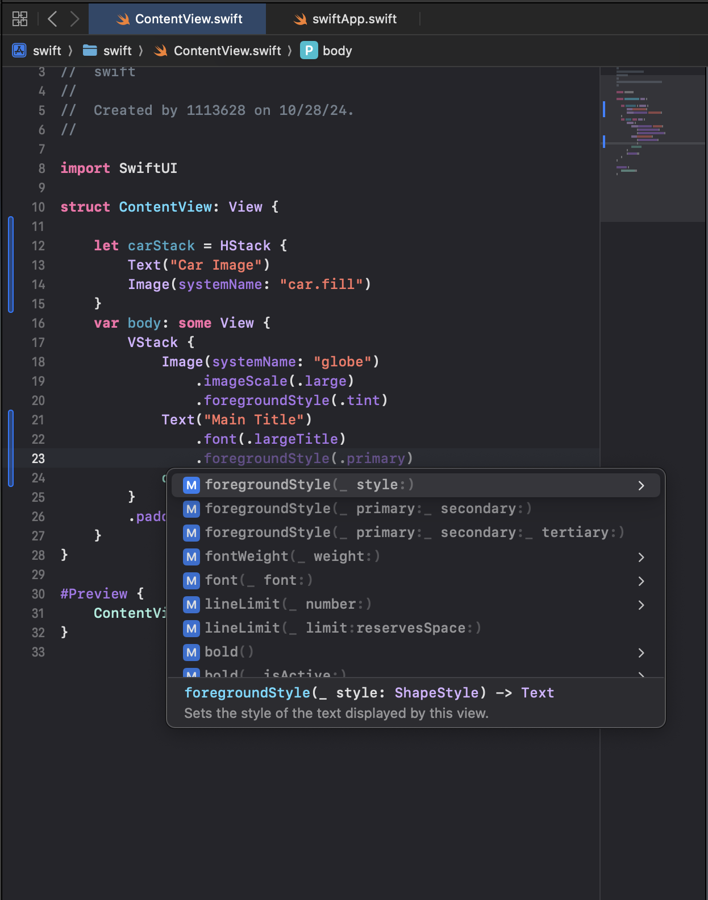 

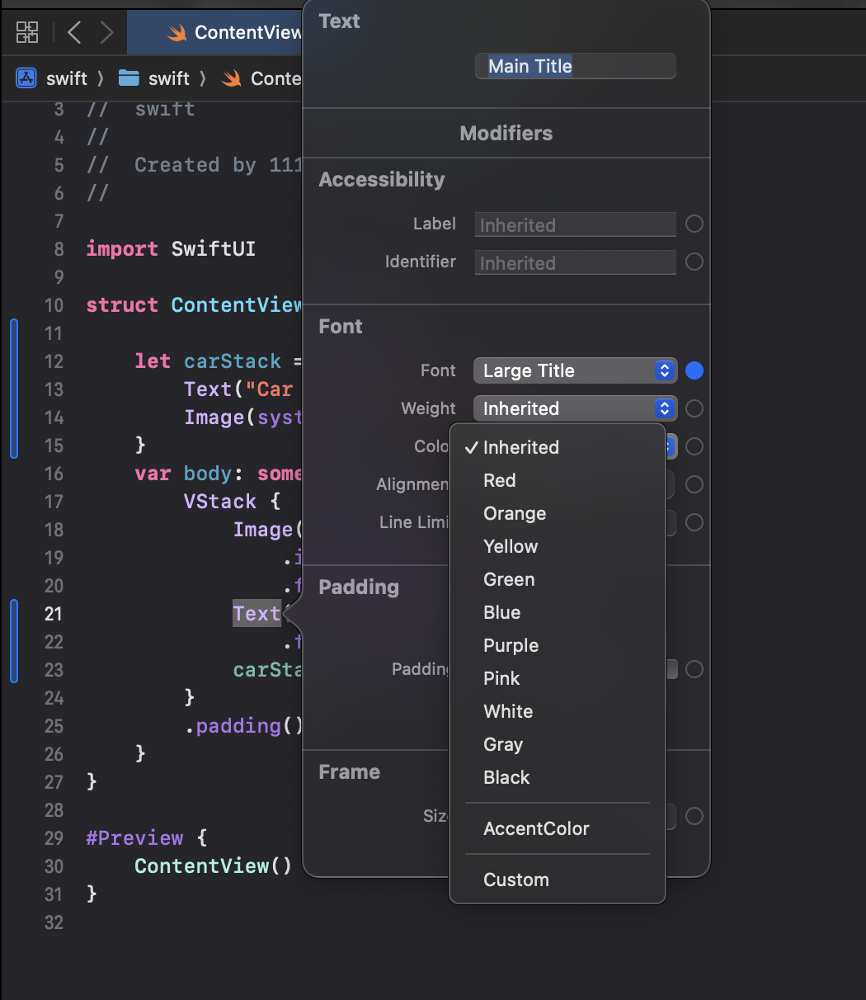

## Text 스타일

iOS에서 설정할 수 있는 Text 스타일

- Large Title
- Title, Title2, Title3
- Headline
- Subheadline
- Body
- Callout
- Footnote
- Caption, Caption2

수정자(modifier)의 순서가 중요

```swift
import SwiftUI

struct ContentView: View {
    
		// 왼쪽 결과
    var body: some View {
        VStack {
            Image(systemName: "globe")
                .imageScale(.large)
                .foregroundStyle(.tint)
            Text("Sample Text")
                .border(Color.black)
                .padding()
        }
        .padding()
    }
}

#Preview {
    ContentView()
}
```

```swift
import SwiftUI

struct ContentView: View {
    
		// 오른쪽 결과
    var body: some View {
        VStack {
            Image(systemName: "globe")
                .imageScale(.large)
                .foregroundStyle(.tint)
            Text("Sample Text")
                .padding()
                .border(Color.black)
        }
        .padding()
    }
}

#Preview {
    ContentView()
}
```

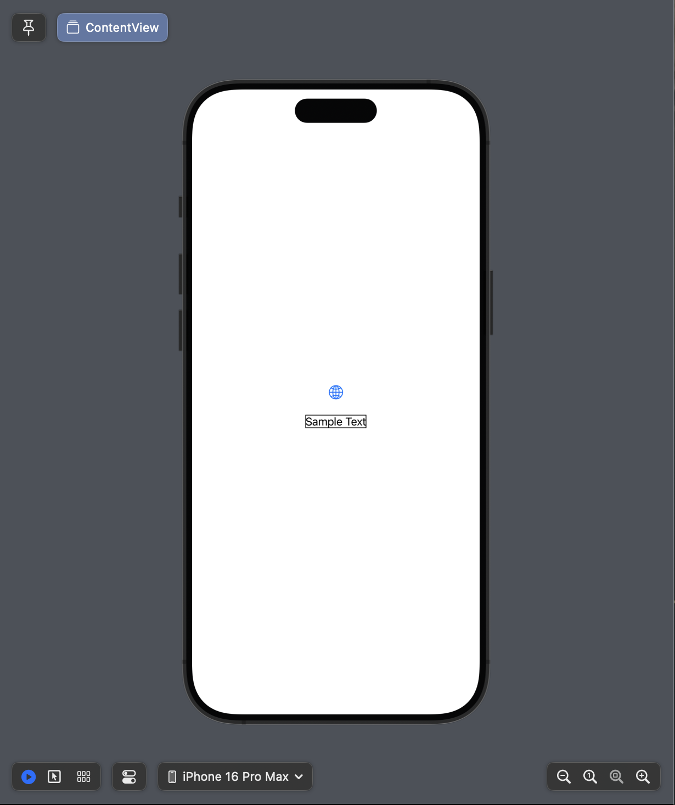 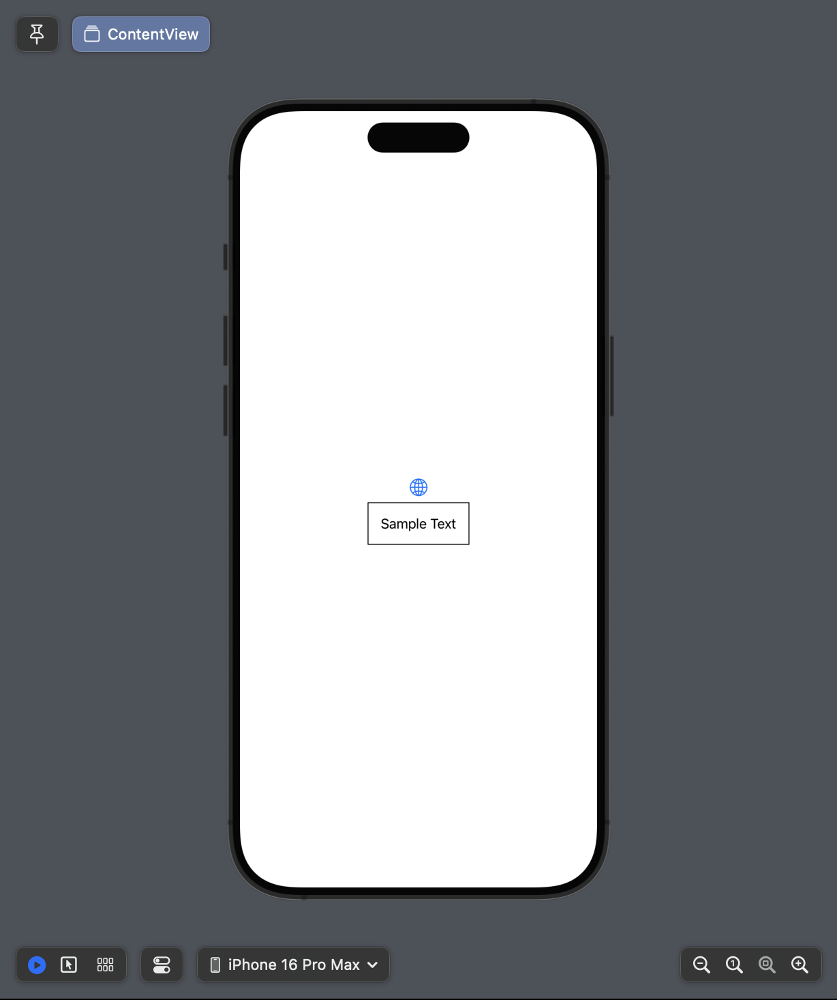

## Custom 수정자

```swift
import SwiftUI

struct ContentView: View {
    var body: some View {
        VStack {
            Image(systemName: "globe")
                .imageScale(.large)
                .foregroundStyle(.tint)
            Text("Sample Text")
                .font(.largeTitle)
                .background(Color.mint)
                .border(Color.gray, width: 0.2)
                .shadow(color: Color.black, radius: 5, x: 0, y: 5)
        }
        .padding()
    }
}

#Preview {
    ContentView()
}
```

```swift
import SwiftUI

struct StandardTextTitle: ViewModifier {
    func body(content: Content) -> some View {
        content
            .font(.largeTitle)
            .background(Color.mint)
            .border(Color.gray, width: 0.2)
            .shadow(color: Color.black, radius: 5, x: 0, y: 5)
    }
}

struct ContentView: View {
    var body: some View {
        VStack {
            Image(systemName: "globe")
                .imageScale(.large)
                .foregroundStyle(.tint)
            Text("Sample Text")
                .modifier(StandardTextTitle())
        }
        .padding()
    }
}

#Preview {
    ContentView()
}
```

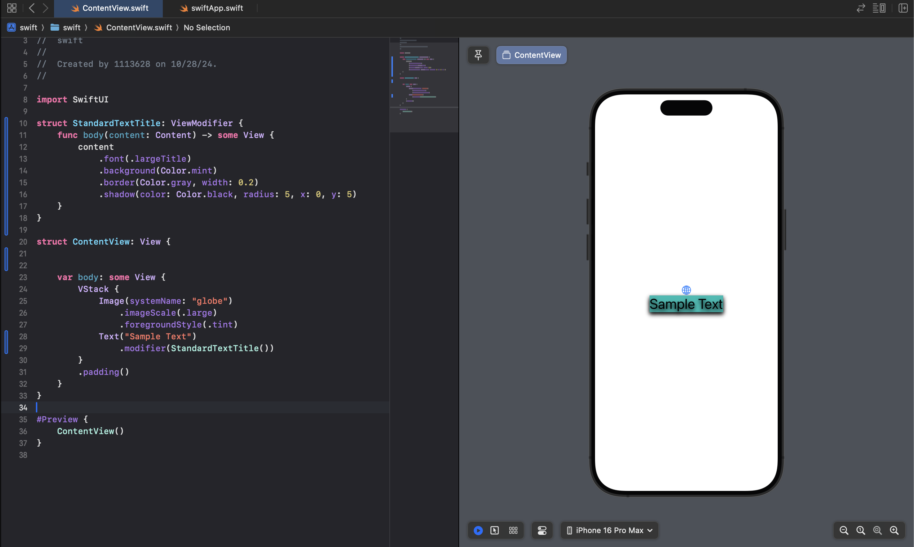

## 기본적인 이벤트 처리

SwiftUI가 데이터 주도적(data-driven) 이라고는 했지만, 사용자 인터페이스인 뷰를 사용자가 조작할 때 발생하는 이벤트 처리는 여전히 필요

```swift
import SwiftUI

struct StandardTextTitle: ViewModifier {
    func body(content: Content) -> some View {
        content
            .font(.largeTitle)
            .background(Color.mint)
            .border(Color.gray, width: 0.2)
            .shadow(color: Color.black, radius: 5, x: 0, y: 5)
    }
}

struct ContentView: View {
    

    var body: some View {
        Button(action: buttonPressed) {
            Text("Click Me")
        }
        .padding()
    }
    
    func buttonPressed() {
        print("Button Pressed")
    }
}

#Preview {
    ContentView()
}
```

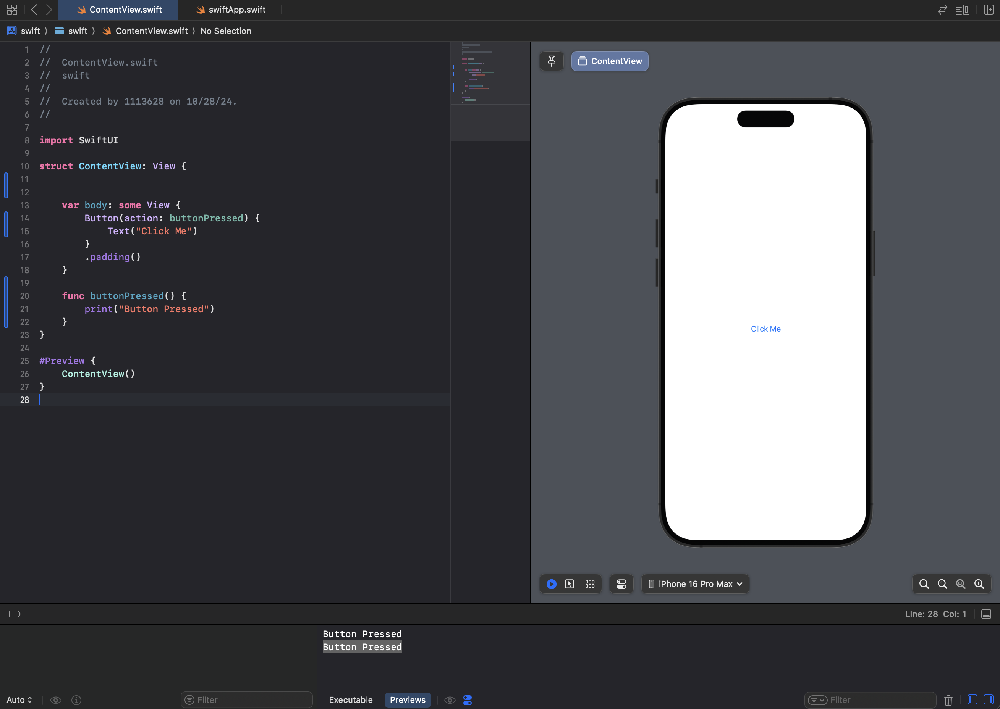

액션 함수를 저정하는 대신, 버튼이 클릭되었을 때 실행될 코드를 클로저로 지정할 수 있음

```swift
import SwiftUI

struct ContentView: View {

    var body: some View {
        Button(action: {
            print("Button Pressed")
        }) {
            Text("Click Me")
        }
        .padding()
    }
}

#Preview {
    ContentView()
}
```

Text 대신 Image View를 버튼으로 생성

```swift
import SwiftUI

struct ContentView: View {

    var body: some View {
        Button(action: {
            print("Button Pressed")
        }) {
            Image(systemName: "square.and.arrow.down")
        }
        .padding()
    }
}

#Preview {
    ContentView()
}
```

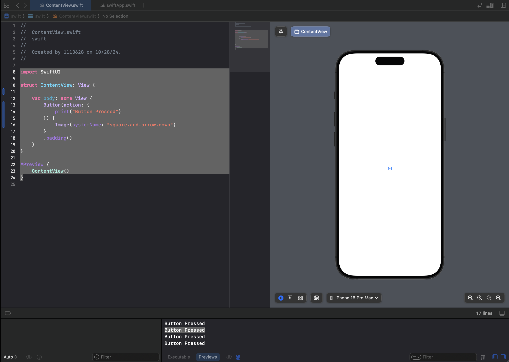

## Custom 컨테이너 View 만들기

* 하위 View의 한가지 한계는 컨테이너 View의 콘텐트가 정적(static) 이라는 점
  * 다시말해, 하위 View가 레이아웃에 포함되는 시점에 하위 View에 포함될 View를 동적으로 지정할 수 없음
* 정적인 컨테이너 뷰가 가지는 한계점을 커스텀 컨테이너 뷰를 활용하여 개선할 수 있음
  * 예를 들어, 아이템마다 간격이 10인 VStack 컨테이너를 다음과 같이 만들어서 재사용하는 것이 가능

```swift
import SwiftUI

struct MyVStack<Content: View>: View {
    let content: () -> Content
    
    init(@ViewBuilder content: @escaping () -> Content) {
        self.content = content
    }
    
    var body: some View {
        VStack(spacing: 10) {
            content()
        }
        .font(.largeTitle)
    }
}

struct ContentView: View {

    var body: some View {
        MyVStack {
            Text("Text 1")
            Text("Text 2")
            HStack {
                Image(systemName: "star.fill")
                Image(systemName: "star.fill")
                Image(systemName: "star")
            }
        }
    }
}

#Preview {
    ContentView()
}
```

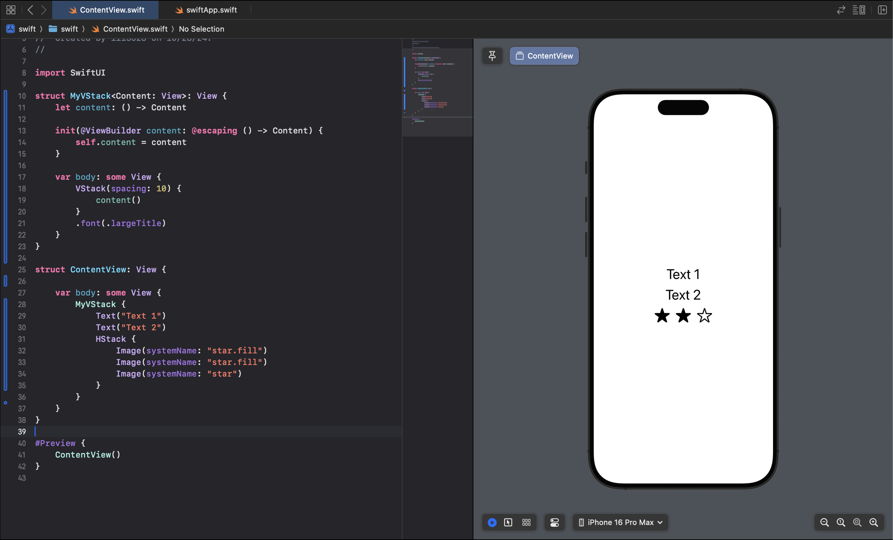

## 레이블 View로 작업하기

* 레이블 View는 아이콘과 텍스트가 나란히 배치된 형태로 구성된다는 점에서 대부분의 다른 SwiftUI View와 다름
  * 이때 이미지는 모든 이미지 애셋이나 셰이프 렌더링(shape rendering) 또는 [SF 심벌](https://developer.apple.com/sf-symbols/)(SF: San Francisco symbol)의 형태를 취할 수 있음
  * SF 심벌은 애플 플랫폼용 앱을 개발할 때 사용할 수 있는 수천 개의 확장 가능한 벡터 드로잉 모음

라이브러리 패널의 심벌 화면을 통해 찾아보고 선택할 수 있음

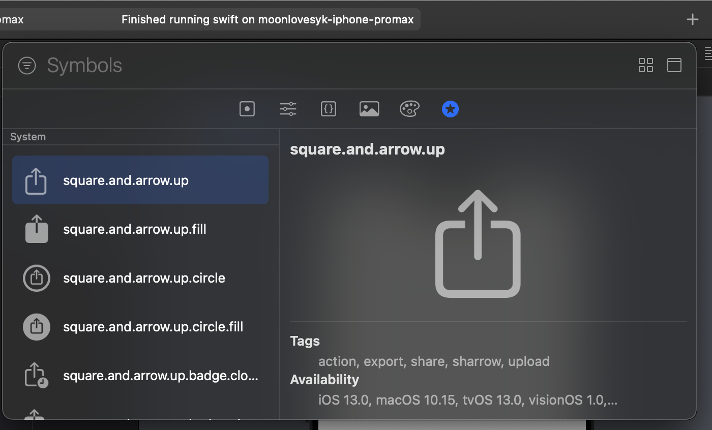

```swift
import SwiftUI

struct ContentView: View {

    var body: some View {
        Label("Welcome to SwiftUI", systemImage: "person.circle.fill")
            .font(.largeTitle)
    }
}

#Preview {
    ContentView()
}
```

이 Label View는 아래와 같이 랜더링 됨

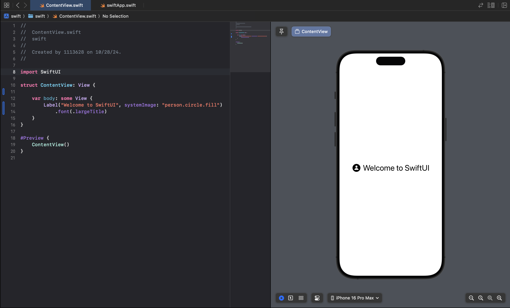

Text 문자열과 이미지를 지정하는 대신, 제목과 아이콘에 대한 별도의 뷰를 사용하여 Label을 선언할수도 있음

```swift
import SwiftUI

struct ContentView: View {

    var body: some View {
        Label(
            title: {
                Text("Weclome to SwiftUI!")
                    .font(.largeTitle)
            },
            icon: {
                Circle()
                    .fill(Color.blue)
                    .frame(width: 25, height: 25)
            }
        )
    }
}

#Preview {
    ContentView()
}
```

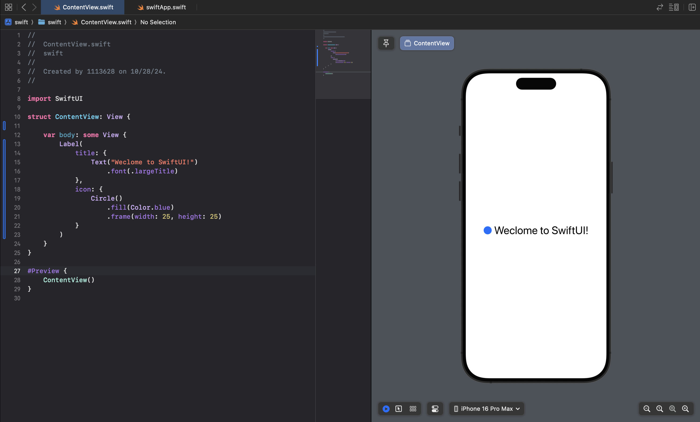

