[TOC]

# SwiftUI 스택과 프레임

## SwiftUI 스택

SwiftUI는 VStack, HStack, ZStack 형태인 3개의 스택 레이아웃 View를 제공

```swift
import SwiftUI

struct ContentView: View {

    var body: some View {
        HStack {
            Image(systemName: "goforward.10")
            Image(systemName: "goforward.15")
            Image(systemName: "goforward.30")
        }
        VStack(spacing: 10) {
            Image(systemName: "goforward.45")
            Image(systemName: "goforward.60")
            Image(systemName: "goforward.75")
        }
        .padding(5)
    }
}

#Preview {
    ContentView()
}
```

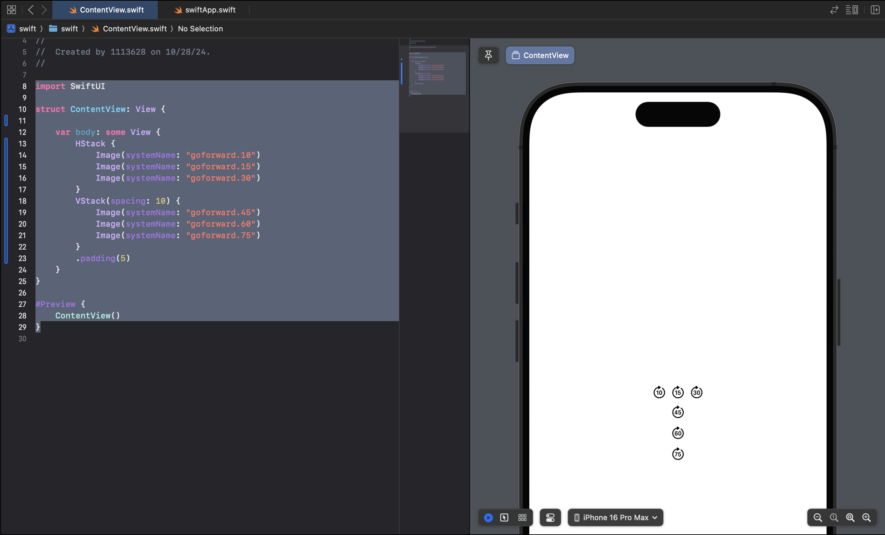

다른 스택 안에 스택을 포함시켜서 상당히 복잡한 레이아웃을 간단하게 설계할 수 있음

```swift
import SwiftUI

struct ContentView: View {

    var body: some View {
        VStack {
            Text("Financial Results")
                .font(.title)
        }
        HStack {
            Text("Q1 Sales")
                .font(.headline)
            
            VStack {
                Text("January")
                Text("February")
                Text("March")
            }
            
            VStack {
                Text("$1,000")
                Text("$200")
                Text("$3,000")
            }
            .padding(5)
        }
    }
}

#Preview {
    ContentView()
}
```

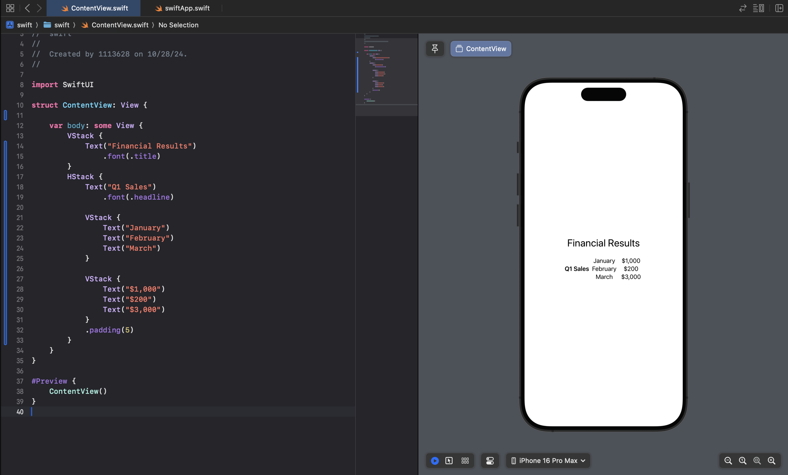

## spacer, alignment, 그리고 padding

- Spacer: Spacer는 배치된 뷰들의 간격을 제공하기 위해 스택의 방향에 따라 유연하게 확장/축소
- alignment: 스택이 선언될 때 정렬 값을 지정

```swift
import SwiftUI

struct ContentView: View {

    var body: some View {
        VStack(alignment: .center, spacing: 15) {
            Text("Financial Results")
                .font(.title)
            
            HStack(alignment: .top) {
                Text("Q1 Sales")
                    .font(.headline)
                Spacer()
                VStack() {
                    Text("January")
                    Text("February")
                    Text("March")
                }
                Spacer()
                VStack(alignment: .leading) {
                    Text("$1,000")
                    Text("$200")
                    Text("$3,000")
                }
                .padding(5)
            }
            .padding(5)
        }
        .padding(5)
    }
}

#Preview {
    ContentView()
}
```

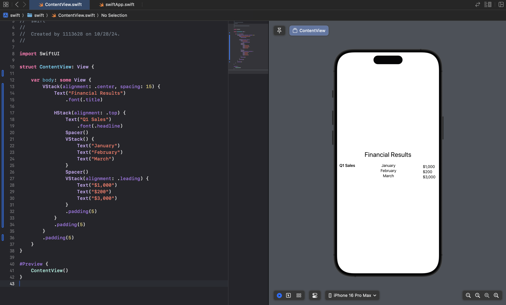

## 컨테이너의 자식 뷰 제한

* 컨테이너 뷰는 직접적인 하위 뷰를 10개로 제한 함
  * 따라서 자식 뷰가 10개를 넘어야 한다면 Group 뷰를 사용하여 직접적인 자식 뷰 개수를 줄일 수 있음
  * 실제로 해보면 10개 이상 만들 수 있었음 (Live Preview, Simulator 모두)

```swift
import SwiftUI

struct ContentView: View {

    var body: some View {
        ScrollView(.vertical) {
            LazyVStack() {
                Text("text1")
                Text("text2")
                Text("text3")
                Text("text4")
                Text("text5")
                Text("text6")
                Text("text7")
                Text("text8")
                Text("text9")
                Text("text10")
                Text("text11")
                Text("text12")
                Text("text13")
                Text("text14")
                Text("text15")
                Text("text16")
                Text("text17")
                Text("text18")
                Text("text19")
                Text("text20")
                Text("text21")
                Text("text22")
                Text("text23")
                Text("text24")
                Text("text25")
                Text("text26")
                Text("text27")
                Text("text28")
                Text("text29")
                Text("text30")
                Text("text31")
                Text("text32")
                Text("text33")
                Text("text34")
                Text("text35")
                Text("text36")
                Text("text37")
                Text("text38")
            }
            .font(.largeTitle)
        }
    }
}

#Preview {
    ContentView()
}
```

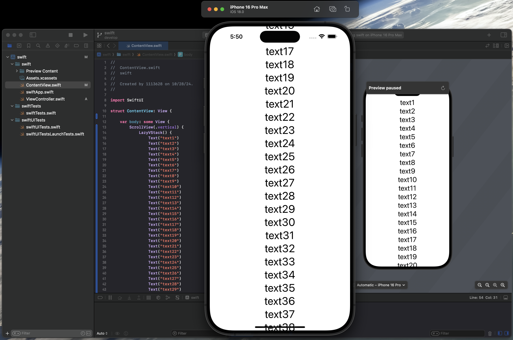

## 동적 HStack과 VStack의 변환

* 설계 단계에서 HStack으로 할지 아니면 VStack으로 할지에 대한 결정은 마지막에 해야 함
* SwiftUI에서는 AnyLayout 인스턴스를 생성하고 HStackLayout 또는 VStackLayout 컨테이너에 할당하여 스택 타입을 앱 코드 내에서 동적으로 변경할 수 있음

```swift
import SwiftUI

struct ContentView: View {
    
    @State var myLayout: AnyLayout = AnyLayout(VStackLayout())
    
    var body: some View {
        VStack {
            myLayout {
                Image(systemName: "goforward.10")
                    .resizable()
                    .aspectRatio(contentMode: .fit)
                Image(systemName: "goforward.15")
                    .resizable()
                    .aspectRatio(contentMode: .fit)
            }
            
            HStack {
                Button(action: {
                    myLayout = AnyLayout(HStackLayout()) }) {
                        Text("HStack")
                    }
            }
            
            Button(action: {
                myLayout = AnyLayout(VStackLayout()) }) {
                    Text("VStack")
                }
        }
    }
}

#Preview {
    ContentView()
}
```

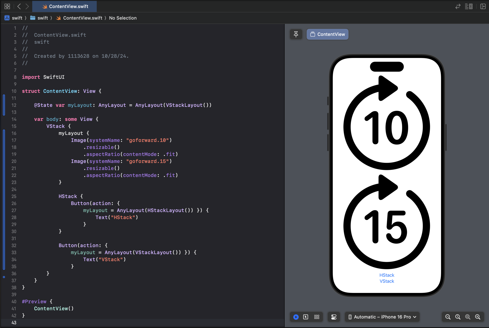 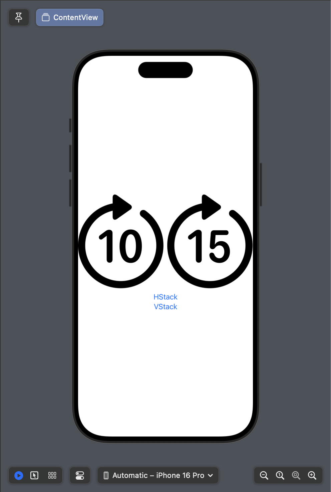

## 텍스트 줄 제한과 레이아웃 우선순위

### 줄 제한

* HStack은 기본적으로 스택의 공간이 충분하다면 뷰를 한 줄로 보여 줌
  * 하지만 스택의 공간이 충분하지 않다면, 텍스트 뷰의 텍스트가 여러 줄로 표시되는 상황이 발생
  * 이때 lineLimit() 수정자를 사용하면 텍스트를 몇줄로 표현할지 정할 수 있음
    * lineLimit(1): 한 줄로 제한
    * lineLimit(1...4): 범위를 지정해서 최대 및 최소 줄 수를 정할 수도 있음

```swift
import SwiftUI

struct ContentView: View {
    
    
    var body: some View {
        HStack {
            Image(systemName: "airplane")
            Text("Lovely Lovely Lovely Lovely Flight times:")
            Text("London")
        }
        .font(.largeTitle)
        .padding(5)
       
        HStack {
            Image(systemName: "airplane")
            Text("Lovely Lovely Lovely Lovely Flight times:")
            Text("London")
        }
        .font(.largeTitle)
        .padding(5)
        .lineLimit(1)

        HStack {
            Image(systemName: "airplane")
            Text("Lovely Lovely Lovely Lovely Flight times:")
            Text("London")
        }
        .font(.largeTitle)
        .padding(5)
        .lineLimit(1...2)
    }
}

#Preview {
    ContentView()
}
```

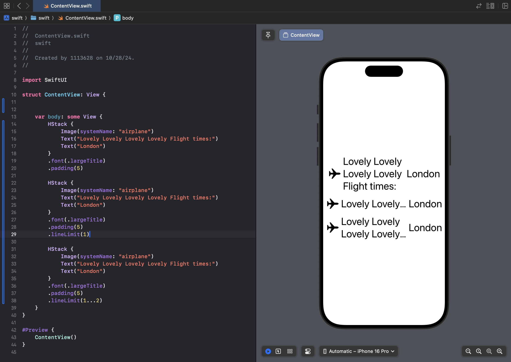

### 우선순위

스택에서 줄을 제한할 때 우선순위가 더 중요하다고 판단되는 View에 Priority를 부여함으로써 줄 제한을 방지 할 수 있음(기본 Priority 값 = 0)

```swift
import SwiftUI

struct ContentView: View {
    
    var body: some View {
        HStack {
            Image(systemName: "airplane")
            Text("Lovely Flight Country: ")
            Text("Republic of Korea (ROK)")
        }
        .font(.largeTitle)
        .padding(10)
       
        HStack {
            Image(systemName: "airplane")
            Text("Lovely Flight Country: ")
            Text("Republic of Korea (ROK)")
        }
        .font(.largeTitle)
        .padding(10)
        .lineLimit(1)

        HStack {
            Image(systemName: "airplane")
            Text("Lovely Flight Country: ")
            Text("Republic of Korea (ROK)")
        }
        .font(.largeTitle)
        .padding(10)
        .lineLimit(1...2)
        
        HStack {
            Image(systemName: "airplane")
            Text("Lovely Flight Country: ")
            Text("Republic of Korea (ROK)")
                .layoutPriority(1)
        }
        .font(.largeTitle)
        .padding(10)
        .lineLimit(1...2)
    }
}

#Preview {
    ContentView()
}
```

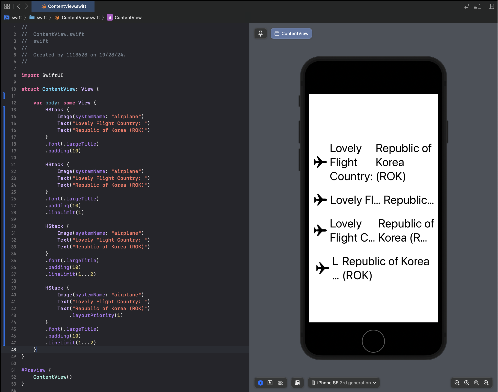

## 전통적 스택 vs. 지연 스택

* ScrollView에서 Stack/VStack View 는 사용자에게 표시되는 지 여부와 관계없이 초기화 시 모든 하위 View를 생성 → 성능 저하로 이어질 수 있음
  * 이 문제를 해결하기 위해 SwiftUI는 LazyVStack, LazyHStack을 지원 → 현재 화면 밖에 View는 사용자에게 표시되는 지점에 도달한 후에만 생성

```swift
import SwiftUI

struct ContentView: View {

    var body: some View {
        ScrollView(.horizontal) {
            LazyHStack() {
                Text("text1")
                Text("text2")
                Text("text3")
                Text("text4")
                Text("text5")
                Text("text6")
                Text("text7")
                Text("text8")
                Text("text9")
                Text("text10")
            }
            .font(.largeTitle)
        }
    }
}

#Preview {
    ContentView()
}
```

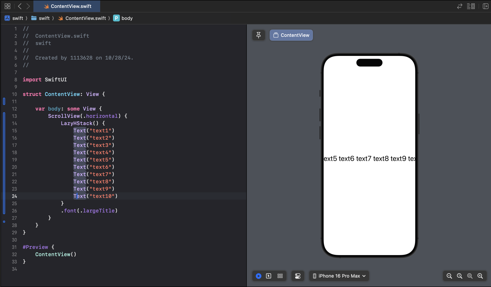

## SwiftUI 프레임

* 기본적으로 뷰는 자신의 content와 자신이 속한 레이아웃에 따라 자동으로 크기가 조절 됨
  * 하지만, 때로는 뷰의 크기나 영역을 설정해야 할 때가 있는데 이때 SwiftUI는 frame modifier를 제공
* 대부분의 경우에는 위처럼 고정된 사이즈를 사용해도 문제가 없지만 텍스트의 길이가 동적으로 변한다면 텍스트가 잘리는 현상이 발생할 수도 있음
  * 이런 문제는 frame의 최대 영역과 최소 영역을 지정하면 해결할 수 있음

```swift
import SwiftUI

struct ContentView: View {

    var body: some View {
        Text("Hello World")
            .font(.largeTitle)
            .border(Color.black)
        
        Text("Hello World")
            .font(.largeTitle)
            .border(Color.black)
            .frame(width: 100, height: 100, alignment: .center)
        
        Text("Hello World, how are you?")
            .font(.largeTitle)
            .border(Color.black)
            .frame(width: 100, height: 100, alignment: .center)

        Text("Hello World, how are you?")
            .font(.largeTitle)
            .border(Color.black)
            .frame(minWidth: 100, maxWidth: 300, minHeight: 100, maxHeight: 300, alignment: .center)

        Text("Hello World, how are you?")
            .font(.largeTitle)
            .border(Color.black)
            .frame(minWidth: 0, maxWidth: .infinity, minHeight: 0, maxHeight: .infinity)
        
        Text("Hello World, how are you?")
            .font(.largeTitle)
            .frame(minWidth: 0, maxWidth: .infinity, minHeight: 0, maxHeight: .infinity)
            .border(Color.black, width: 5)
    }
}

#Preview {
    ContentView()
}
```

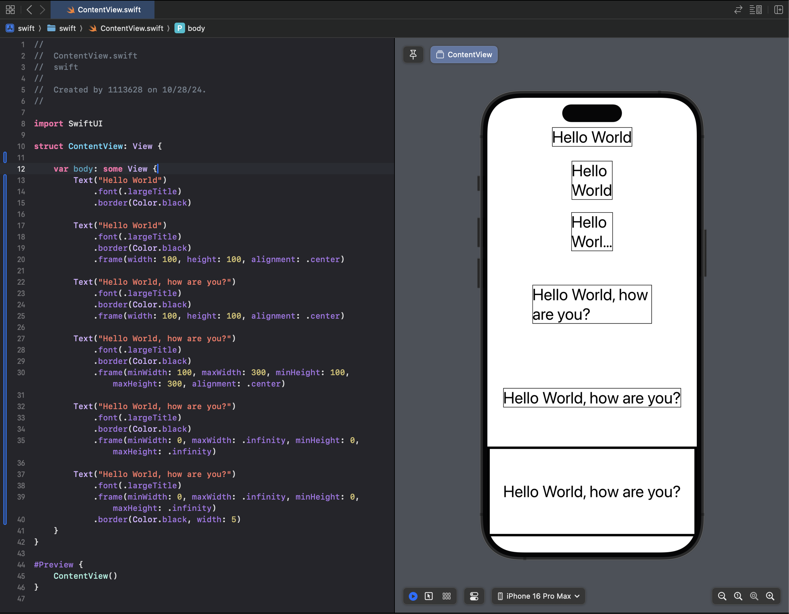

이렇게 하면 좀 더 유연하게 대응할 수 있음

* frame으로 화면을 채울 때 swift는 안전 영역을 준수 함
* 애플의 일부 디바이스에서 카메라 노치가 차지하는 부분과 같은 영역을 안전 영역이라고 함
* 이 안전 영역을 무시하기 위해서는 edgesIgnoringSafeArea() modifier를 사용하면 됨

```swift
import SwiftUI

struct ContentView: View {

    var body: some View {
        Text("Hello World")
            .font(.largeTitle)
            .border(Color.black)
            .edgesIgnoringSafeArea(.all)

        Text("Hello World")
            .font(.largeTitle)
            .border(Color.black)
            .frame(width: 100, height: 100, alignment: .center)
        
        Text("Hello World, how are you?")
            .font(.largeTitle)
            .border(Color.black)
            .frame(width: 100, height: 100, alignment: .center)

        Text("Hello World, how are you?")
            .font(.largeTitle)
            .border(Color.black)
            .frame(minWidth: 100, maxWidth: 300, minHeight: 100, maxHeight: 300, alignment: .center)

        Text("Hello World, how are you?")
            .font(.largeTitle)
            .border(Color.black)
            .frame(minWidth: 0, maxWidth: .infinity, minHeight: 0, maxHeight: .infinity)
        
        Text("Hello World, how are you?")
            .font(.largeTitle)
            .frame(minWidth: 0, maxWidth: .infinity, minHeight: 0, maxHeight: .infinity)
            .border(Color.black, width: 5)
    }
}

#Preview {
    ContentView()
}
```

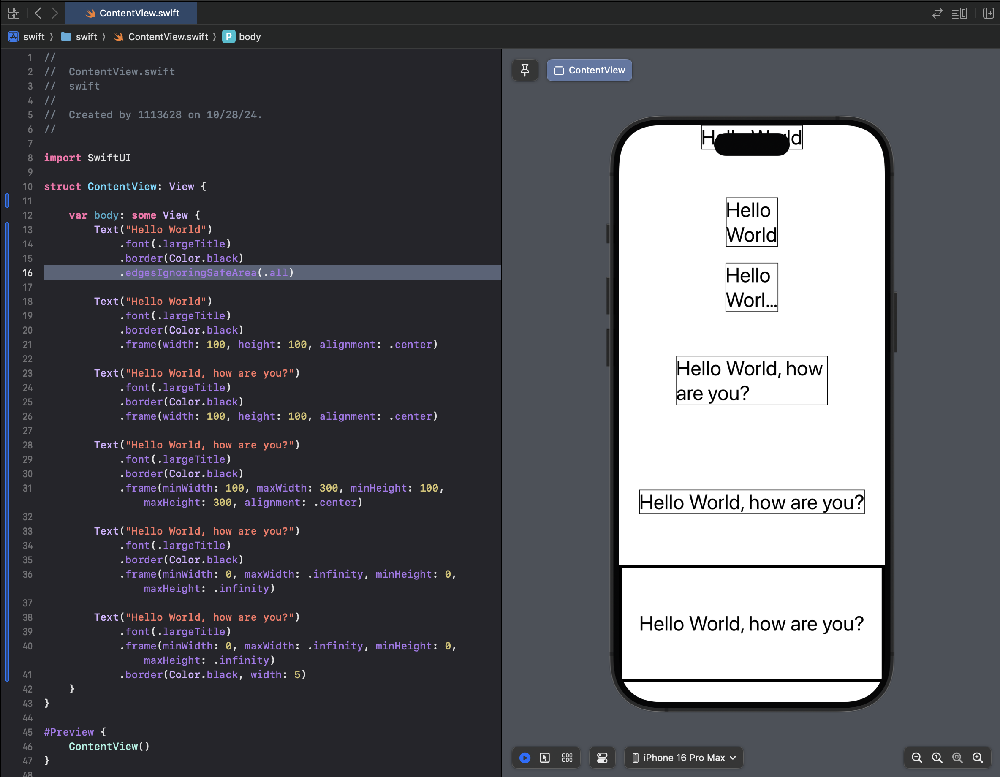

## frame과 GeometryReader

GeometryReader를 활용하면 뷰를 감싸고 있는 컨테이너의 크기를 계산하여 frame의 크기를 컨테이너의 크기에 따라 조절하는 것이 가능

```swift
import SwiftUI

struct ContentView: View {

    var body: some View {
        GeometryReader { geometry in
            VStack {
                Text("Hello World, how are you?")
                    .font(.largeTitle)
                    .frame(width: geometry.size.width / 2,
                           height: (geometry.size.height / 4) * 3)
                    .border(Color.black)

                Text("Goodbye World")
                    .font(.largeTitle)
                    .frame(width: geometry.size.width / 3,
                           height: geometry.size.height / 4)
                    .border(Color.black)
            }
        }
    }
}

#Preview {
    ContentView()
}
```

위와 같이 설정하면 상단 텍스트는 VStack의 1/2 폭과 3/4의 높이를 차지하고 하단 텍스트는 VStack의 1/3 폭과 1/4의 높이를 차지하도록 설정할 수 있음

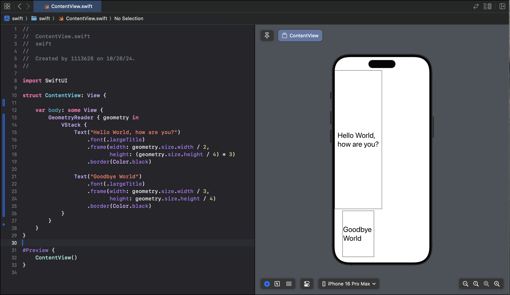