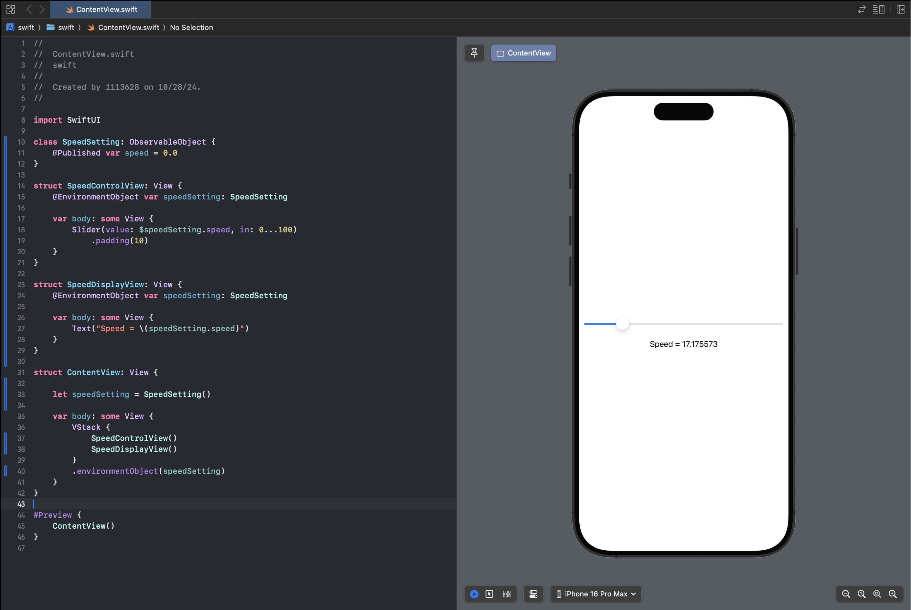

[TOC]

# SwiftUI 상태 프로퍼티, Observable, State, Environment 객체

* SwiftUI는 데이터 주도 방식의 개발을 강조 함
* 기본 데이터의 변경에 따른 처리 코드를 작성하지 않아도 뷰가 업데이트 됨
* 이것은 데이터와 사용자 인터페이스 내의 뷰 사이에 게시자(publisher)와 구독자(subscriber)를 구축하여 할 수 있음
  * 이를 위해서 SwiftUI는 상태 프로퍼티, Observable 객체, State 객체, Environment 객체를 제공

## 상태 프로퍼티

- 상태에 대한 가장 기본적인 형태로, 다음과 같은 뷰 레이아웃의 상태를 저장하기 위해서만 사용
  - 토글 버튼 활성 여부
  - 텍스트 필드 입력 값
  - 피커 뷰의 현재 선택
- 상태 프로퍼티는 String이나 Int 값처럼 간단한 데이터를 저장하기 위해 사용되며 @State 프로퍼티 래퍼를 사용하여 선언

```swift
struct ContentView: View {
	@State private var wifiEnabled = true
    @State private var userName = ""
    
    var body: some View {
    	// Something...
    }
}
```

- 상태 값은 해당 뷰에 속한 것이기 때문에 private 프로퍼티로 선언되어야 함
- 상태 프로퍼티에 대한 바인딩은 $을 사용하여 할 수 있음

```swift
struct ContentView: View {
	@State private var wifiEnabled = true
    @State private var userName = ""
    
    var body: some View {
    	VStack {
        	TextField("Enter user name", text: $userName)
        }
    }
}
```

- 이렇게 하면 사용자의 입력값이 userName에 저장되고 userName에 변화가 생길 때마다 뷰 계층 구조는 SwiftUI에 의해 다시 렌더링
- 상태 프로퍼티의 값을 변경하지 않고 참조하여 사용할 때는 다음과 같이 사용하면 됨

```swift
@State private var wifiEnabled = true
@State private var userName = ""

var body: some View {
	VStack {
    	Toggle(isOn: $wifiEnabled) {
        	Text("Enabled Wi-Fi")
        }
        TextField("Enter user name", text: $userName)
        Text(userName)
        Image(systemName: wifiEnabled ? "wifi" : "wifi.slash")
    }
}
```

* 위처럼 단순하게 상태 프로퍼티를 참조하는 경우에는 $를 붙이지 않아도 됨

전체 코드는 아래와 같음

```swift
import SwiftUI

struct ContentView: View {

    @State private var wifiEnabled: Bool = true
    @State private var userName = ""
    
    var body: some View {
        VStack {
            Toggle(isOn: $wifiEnabled) {
                Text("Enable Wi-Fi")
            }
            Spacer()
            Image(systemName: wifiEnabled ? "wifi" : "wifi.slash")
            Spacer()
            TextField("Enter user name", text: $userName)
                .padding()
                .background(Color.gray.opacity(0.1))
                .cornerRadius(10)
                .border(Color.gray, width: 1)
            Spacer()
            Text(userName)
                .padding()
                .background(Color.green.opacity(0.1))
                .cornerRadius(10)
                .border(Color.gray, width: 1)
                .frame(minWidth: 100, maxWidth: 300, minHeight: 0, maxHeight:0, alignment: .center)
        }
        .padding(10)
    }
}

#Preview {
    ContentView()
}
```


## State 바인딩

```swift
struct ContentView: View {
	@State private var wifiEnabled = true
    @State private var userName = ""
    
    var body: some View {
      VStack {
          Toggle(isOn: $wifiEnabled) {
              Text("Enabled Wi-Fi")
          }
          TextField("Enter user name", text: $userName)
          Text(userName)
          Image(systemName: wifiEnabled ? "wifi" : "wifi.slash")
      }
    }
}
```

* 위의 코드에서 Image 뷰를 하위 뷰로 분리

```swift
struct ContentView: View {
	@State private var wifiEnabled = true
    @State private var userName = ""
    
    var body: some View {
      VStack {
          Toggle(isOn: $wifiEnabled) {
              Text("Enabled Wi-Fi")
          }
          TextField("Enter user name", text: $userName)
          Text(userName)
          WifiImageView(wifiEnabled: $wifiEnabled)
      }
    }
}

struct WifiImageView: View {
	@Binding var wifiEnabled: Bool
    
    var body: some View {
    	Image(systemName: wifiEnabled ? "wifi" : "wifi.slash")
    }
}
```

- 단순하게 Image 뷰를 하위 뷰로 분리시키기만 한다면, WifiImageView 입장에서는 wifiEnabled 프로퍼티는 정의되지 않은 변수
- 따라서 @Binding 프로퍼티 래퍼를 이용하여 프로퍼티를 선언하고 하위 뷰를 호출할 때 상태 프로퍼티에 대한 바인딩을 전달

전체 코드는 아래와 같음

```swift
import SwiftUI

struct ContentView: View {

    @State private var wifiEnabled: Bool = true
    @State private var userName = ""
    
    var body: some View {
        VStack {
            Toggle(isOn: $wifiEnabled) {
                Text("Enable Wi-Fi")
            }
            Spacer()
            WifiImageView(wifiEnabled: $wifiEnabled)
            Spacer()
            TextField("Enter user name", text: $userName)
                .padding()
                .background(Color.gray.opacity(0.1))
                .cornerRadius(10)
                .border(Color.gray, width: 1)
            Spacer()
            Text(userName)
                .padding()
                .background(Color.green.opacity(0.1))
                .cornerRadius(10)
                .border(Color.gray, width: 1)
                .frame(minWidth: 100, maxWidth: 300, minHeight: 0, maxHeight:0, alignment: .center)
        }
        .padding(10)
    }
}

struct WifiImageView: View {
    @Binding var wifiEnabled: Bool
    
    var body: some View {
        Image(systemName: wifiEnabled ? "wifi" : "wifi.slash")
    }
}

#Preview {
    ContentView()
}
```


## Observable 객체

* 상태 프로퍼티는 일시적인 것이어서 부모 뷰가 사라지면 그 상태도 사라짐
* 반면, Observable 객체는 여러 다른 뷰들이 외부에서 접근할 수 있는 지속적인 데이터를 표현하기 위해 사용
* Observable 객체는 ObservableObject 프로토콜을 따르는 클래스나 구조체 형태를 취함
* Observable 객체는 일반적으로 시간에 따라 변경되는 하나 이상의 데이터 값을 모으고 관리하는 역할
  * 안드로이드에서 StateFlow와 유사한 요소
  * StateFlow와의 차이점이라면 StateFlow는 비동기로 처리가 되지만 Observable은 동기적으로 처리되어 UI가 바로 반응
* Observable 객체의 게시된 프로퍼티를 구현하는 가장 쉬운 방법은 프로퍼티를 선언할 때 @Published 프로퍼티 래퍼를 사용하는 것
  * 이 래퍼는 래퍼 프로퍼티 값이 변경될 때마다 모든 구독자에게 업데이트를 알리게 됨

```swift
import Foundation
import Combine

class DemoData: ObservableObject {
		@Published var userCount = 0
    @Published var currentUser = ""
    
    init() {
    	// 데이터를 초기화하기 위한 코드가 여기 온다.
        updateData()
    }
    
    func updateData() {
    	// 데이터를 최신 상태로 유지하기 위한 코드가 여기 온다.
    }
}
```

* 구독자는 Observable 객체를 구독하기 위하여 @ObservedObject 또는 @StateObject 프로퍼티 래퍼를 사용
* 구독하게 되면 상태 프로퍼티에서 사용했던 것과 같은 방식으로 게시된 프로퍼티에 접근

전체 코드는 아래와 같음

```swift
import Foundation
import Combine
import SwiftUI

class DemoData : ObservableObject {
    @Published var userCount = 0
    @Published var currentUser = "Hyeongmun Lee"
    
    init() {
        // 데이터를 초기화하기 위한 코드가 여기 온다.
        updateData()
    }
    
    func updateData() {
        // 데이터를 최신 상태로 유지하기 위한 코드가 여기 온다.
    }
}

struct ContentView: View {

    @ObservedObject var demoData : DemoData = DemoData()
    
    var body: some View {
        Text("\(demoData.currentUser), 너는 \(demoData.userCount) 번째 순서이다.")
    }
}

//struct ContentView_Previews: PreviewProvider {
//    static var previews: some View {
//        ContentView(demoData: DemoData())
//    }
//}

#Preview {
    ContentView()
}
```


## State 객체

```swift
struct ContentView: View {
	@StateObject var demoData: DemoData = DemoData()
    
    var body: some View {
    	Text("\(demoData.currentUser), 너는 \(demoData.userCount) 번째 순서이다.")
    }
}
```

* @StateObject는 @ObservedObject 래퍼의 대안
  * 이 둘의 차이점은 @ObservedObject는 변수를 선언한 View가 소유하지 않으므로 사용되는 동안에(에를 들어, View가 다시 렌더링된 결과) SwiftUI 시스템에 의해 파되 되거나 다시 생성될 위험이 있음
  * @ObservedObject 대신 @StateObject를 사용하면 해당 상태를 참조하는 뷰가 계속해서 상태값을 필요로 하는 동안에는 SwiftUI에 의해 파괴되지 않음
* @ObservedObject를 사용할 특별한 이유가 없다면 @StateObject를 사용하여 객체를 구독하는 것이 좋음

전체 코드는 아래와 같음

```swift
import Foundation
import Combine
import SwiftUI

class DemoData : ObservableObject {
    @Published var userCount = 0
    @Published var currentUser = "Hyeongmun Lee"
    
    init() {
        // 데이터를 초기화하기 위한 코드가 여기 온다.
        updateData()
    }
    
    func updateData() {
        // 데이터를 최신 상태로 유지하기 위한 코드가 여기 온다.
    }
}

struct ContentView: View {

    @StateObject var demoData: DemoData = DemoData()
    
    var body: some View {
        Text("\(demoData.currentUser), 너는 \(demoData.userCount) 번째 순서이다.")
    }
}

//struct ContentView_Previews: PreviewProvider {
//    static var previews: some View {
//        ContentView(demoData: DemoData())
//    }
//}

#Preview {
    ContentView()
}
```

## Environment 객체

* 특정 상태 객체에 대해서 다른 뷰에서도 동일한 객체에 접근해야 한다면 내비게이션 과정에서 객체에 대한 참조를 전달해야 함

```swift
@StateObject var demoData: DemoData = DemoData()

NavigationLink(destination: SecondView(demoData)) {
	Text("Next Screen")
}
```

* NavigationLink는 SecondView라는 이름의 다른 뷰로 이동하기 위해 사용되며, demoData 객체에 대한 참조를 전달
* 이 방식은 대부분의 경우 사용할 수 있지만 앱 내의 여러 뷰가 동일한 구독 객체에 접근해야 하는 경우에는 복잡해지므로 Environment 객체를 사용하는 것이 더 합리적일 수 있
* Environment 객체도 ObservableObject 프로토콜을 따라야 하며, @Published가 붙어있는 변수를 자식 뷰가 구독하여 사용할 수 있음
  * 이렇게 선언하면 이 객체는 뷰에서 뷰로 전달할 필요 없이 모든 자식 뷰가 접근 가능

```swift
class SpeedSetting: ObservableObject {
	@Published var speed = 0.0
}
```

* Environment 객체를 구독해야 하는 뷰는 @StateObject 또는 @ObservableObject 대신 @EnvironmentObject를 사용하여 객체를 참조하기만 하면 됨

```swift
struct SpeedControlView: View {
	@EnvironmentObject var speedSetting: SpeedSetting
    
    var body: some View {
    	Slider(value: $speedSetting.speed, in: 0...100)
    }
}

struct SpeedDisplayView: View {
	@EnvironmentObject var speedSetting: SpeedSetting
    
    var body: some View {
    	Text("Speed = \(speedSetting.speed)")
    }
}
```

* 위의 코드에서 두개의 뷰가 사용하는 speedSetting 객체는 어디에서 생성되어야 할까?
  * 논리적으로는 두 뷰의 상위 뷰에서 초기화되어야 함

```swift
struct ContentView: View {
	let speedSetting = SpeedSetting()
    
    var body: some View {
    	VStack {
        	SpeedControlView()
            SpeedDisplayView()
        }
        .environmentObject(speedSetting)
    }
}
```

* 여기서 주목할 점은 .environmentObject(speedSetting) 임
  * 이 코드를 생략하면 관찰 가능한 객체의 인스턴스만 생성할 뿐 뷰 계층 구조에 삽입되지 않음
  * environmentObject() modifier를 사용하여 뷰 계층 구조에 삽입해야 함
* 이렇게 하면 어떠한 상태 객체를 여러 뷰에서 접근하여 사용해야 할 때 직접 객체를 전달하지 않아도 ContentView의 모든 하위 뷰에서 접근할 수 있게 됨

전체 코드는 아래와 같음

```swift
import SwiftUI

class SpeedSetting: ObservableObject {
    @Published var speed = 0.0
}

struct SpeedControlView: View {
    @EnvironmentObject var speedSetting: SpeedSetting
    
    var body: some View {
        Slider(value: $speedSetting.speed, in: 0...100)
            .padding(10)
    }
}

struct SpeedDisplayView: View {
    @EnvironmentObject var speedSetting: SpeedSetting
    
    var body: some View {
        Text("Speed = \(speedSetting.speed)")
    }
}

struct ContentView: View {

    let speedSetting = SpeedSetting()
    
    var body: some View {
        VStack {
            SpeedControlView()
            SpeedDisplayView()
        }
        .environmentObject(speedSetting)
    }
}

#Preview {
    ContentView()
}
```


