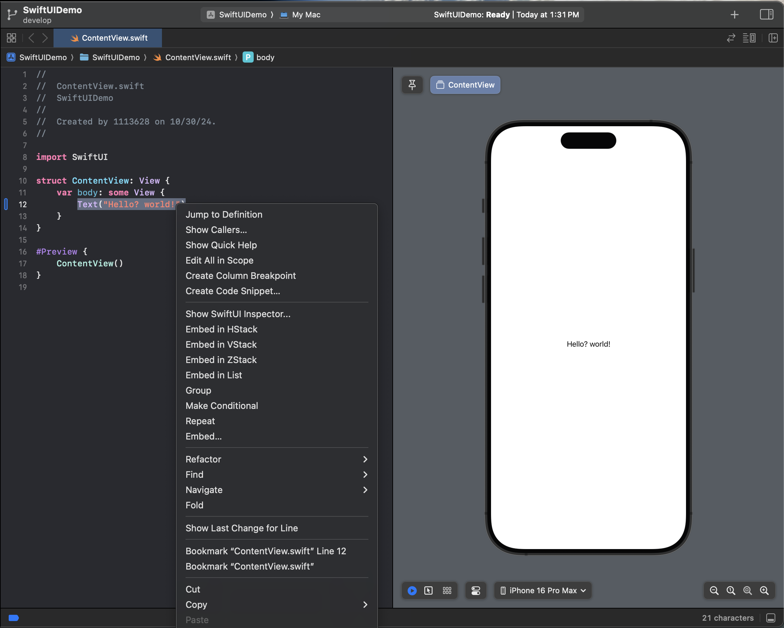
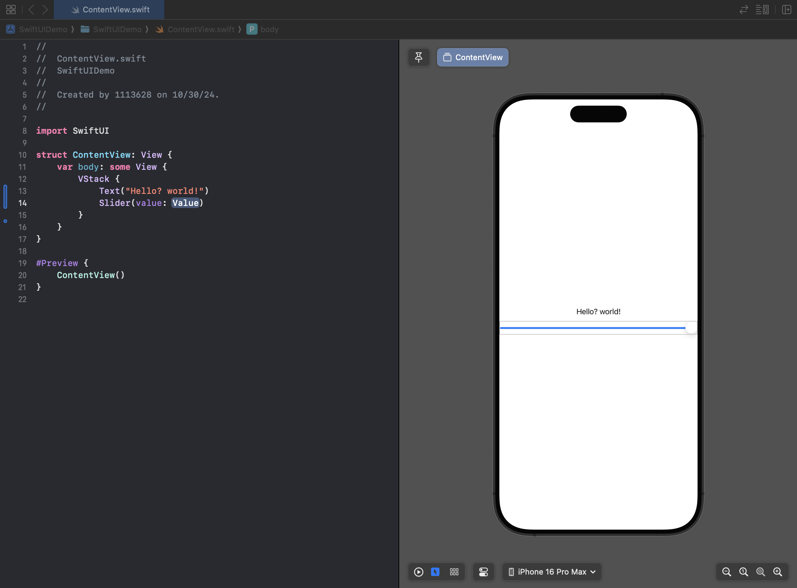
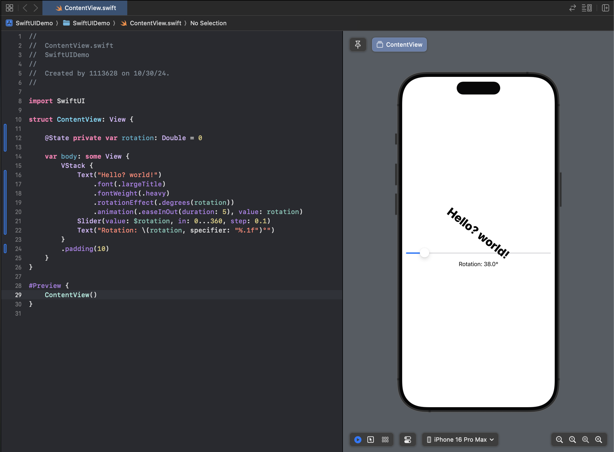
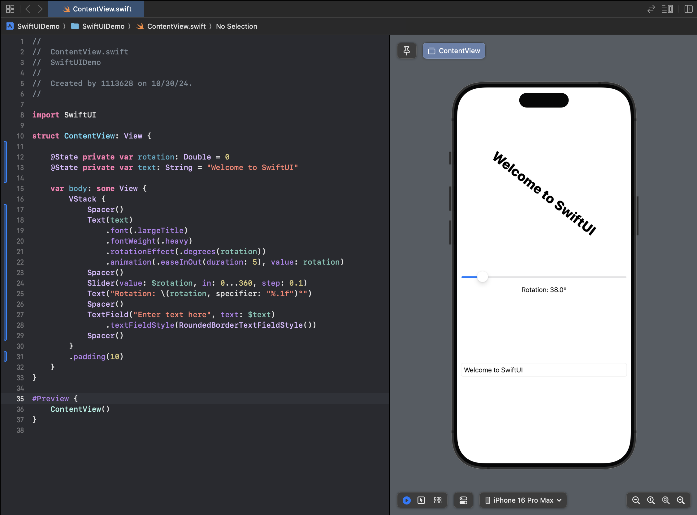
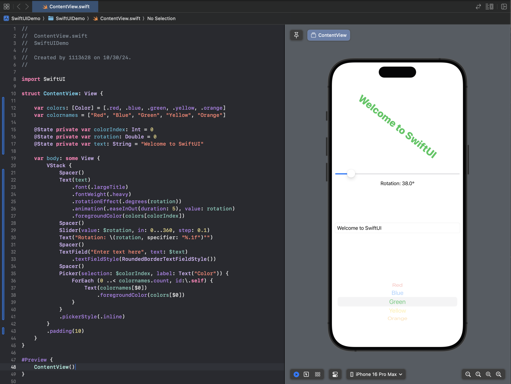
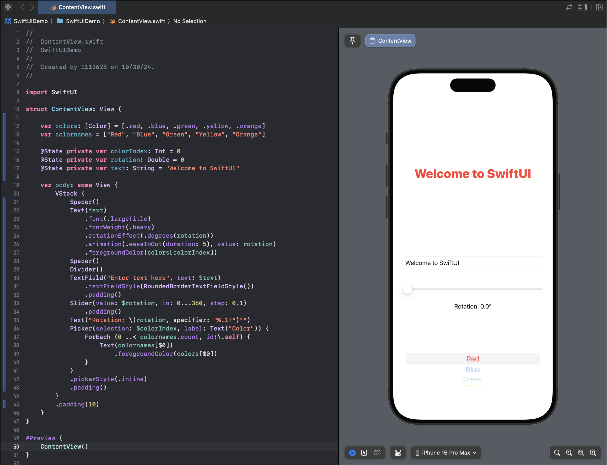

[TOC]

# SwiftUI 예제 튜토리얼

## 예제 프로젝트 생성

* 프로젝트 템플릿 선택 화면에서 'Multiplatform - App' 선택


* Product Name으로 'SwiftUIDemo' 지정
* Team에는 자신의 Team 선택


## 프로젝트 살펴보기

* Multiplatform 으로 선택하였고, SwiftUI가 Cross Platform 을 지원하기 때문에 기본적으로 Mac App으로 Live Preview가 나타남


* Live Preview Device를 iOS로 변경


## 레이아웃 수정하기

* View를 선택하고 오른쪽 클릭하면 레이아웃을 Embed 할 수 있음 (굳이...귀찮게...)



## 스택에 슬라이더 뷰 추가하기

* Library 에서 Slider를 검색하여 Live Preview 화면에 끌어다 놓음


* 책에서는 Slider View를 Live Preview에 끌어다 놓으면 된다고 했으나, 실제로는 안됨
  * 더블클릭 하니 추가 됨



## 상태 프로퍼티 추가하기

* 지금까지 많이 해본 Slider 값 변수에 @State 추가

```swift
import SwiftUI

struct ContentView: View {

    @State private var rotation: Double = 0

    var body: some View {
        VStack {
            Text("Hello? world!")
            Slider(value: $rotation, in: 0...360, step: 0.1)
        }
        .padding(10)
    }
}

#Preview {
    ContentView()
}
```

## Text 뷰에 수정자 추가하기

* Editor에서 Text View 부분에서 마우스 오른쪽 클릭 후 '**Show SwiftUI Inspector**' 클릭


## 회전과 애니메이션 추가하기

* Slider에 의해 조절되어 저장된 값을 이용하여 회전과 애니메이션 효과를 Text View에 추가
  * 애니메이션은 41장에서 자세히 설명 예정

```swift
import SwiftUI

struct ContentView: View {

    @State private var rotation: Double = 0

    var body: some View {
        VStack {
            Text("Hello? world!")
                .font(.largeTitle)
                .fontWeight(.heavy)
                .rotationEffect(.degrees(rotation))
                .animation(.easeInOut(duration: 5), value: rotation)
            Slider(value: $rotation, in: 0...360, step: 0.1)
            Text("Rotation: \(rotation, specifier: "%.1f")°")
        }
        .padding(10)
    }
}

#Preview {
    ContentView()
}
```



## 스택에 TextField 추가하기

* TextField 입력값이 Text View에 나타나도록 수정

```swift
import SwiftUI

struct ContentView: View {

    @State private var rotation: Double = 0
    @State private var text: String = "Welcome to SwiftUI"

    var body: some View {
        VStack {
            Spacer()
            Text(text)
                .font(.largeTitle)
                .fontWeight(.heavy)
                .rotationEffect(.degrees(rotation))
                .animation(.easeInOut(duration: 5), value: rotation)
            Spacer()
            Slider(value: $rotation, in: 0...360, step: 0.1)
            Text("Rotation: \(rotation, specifier: "%.1f")°")
            Spacer()
            TextField("Enter text here", text: $text)
                .textFieldStyle(RoundedBorderTextFieldStyle())
            Spacer()
        }
        .padding(10)
    }
}

#Preview {
    ContentView()
}
```



## 색상 피커 추가하기

* 색상 Picker를 추가하고, 선택값에 따라 Text  색상이 변경되도록 함
  * pickerStyle 옵션 항목이 변경 됨 (.wheel → .inline)

```swift
import SwiftUI

struct ContentView: View {
    
    var colors: [Color] = [.red, .blue, .green, .yellow, .orange]
    var colornames = ["Red", "Blue", "Green", "Yellow", "Orange"]
    
    @State private var colorIndex: Int = 0
    @State private var rotation: Double = 0
    @State private var text: String = "Welcome to SwiftUI"

    var body: some View {
        VStack {
            Spacer()
            Text(text)
                .font(.largeTitle)
                .fontWeight(.heavy)
                .rotationEffect(.degrees(rotation))
                .animation(.easeInOut(duration: 5), value: rotation)
                .foregroundColor(colors[colorIndex])
            Spacer()
            Slider(value: $rotation, in: 0...360, step: 0.1)
            Text("Rotation: \(rotation, specifier: "%.1f")°")
            Spacer()
            TextField("Enter text here", text: $text)
                .textFieldStyle(RoundedBorderTextFieldStyle())
            Spacer()
            Picker(selection: $colorIndex, label: Text("Color")) {
                ForEach (0 ..< colornames.count, id:\.self) {
                    Text(colornames[$0])
                        .foregroundColor(colors[$0])
                }
            }
            .pickerStyle(.inline)
        }
        .padding(10)
    }
}

#Preview {
    ContentView()
}
```



## 레이아웃 정리하기

* .padding, Spacer(), Devider() 를 추가하여 레이아웃을 좀 더 깔끔하게 정리

```swift
import SwiftUI

struct ContentView: View {
    
    var colors: [Color] = [.red, .blue, .green, .yellow, .orange]
    var colornames = ["Red", "Blue", "Green", "Yellow", "Orange"]
    
    @State private var colorIndex: Int = 0
    @State private var rotation: Double = 0
    @State private var text: String = "Welcome to SwiftUI"

    var body: some View {
        VStack {
            Spacer()
            Text(text)
                .font(.largeTitle)
                .fontWeight(.heavy)
                .rotationEffect(.degrees(rotation))
                .animation(.easeInOut(duration: 5), value: rotation)
                .foregroundColor(colors[colorIndex])
            Spacer()
            Divider()
            TextField("Enter text here", text: $text)
                .textFieldStyle(RoundedBorderTextFieldStyle())
                .padding()
            Slider(value: $rotation, in: 0...360, step: 0.1)
                .padding()
            Text("Rotation: \(rotation, specifier: "%.1f")°")
            Picker(selection: $colorIndex, label: Text("Color")) {
                ForEach (0 ..< colornames.count, id:\.self) {
                    Text(colornames[$0])
                        .foregroundColor(colors[$0])
                }
            }
            .pickerStyle(.inline)
            .padding()
        }
        .padding(10)
    }
}

#Preview {
    ContentView()
}
```


