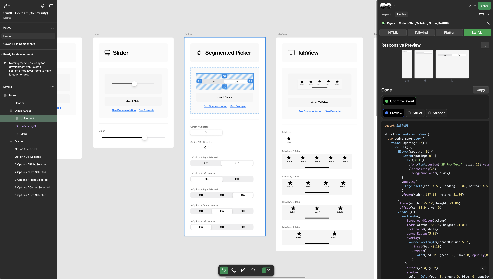
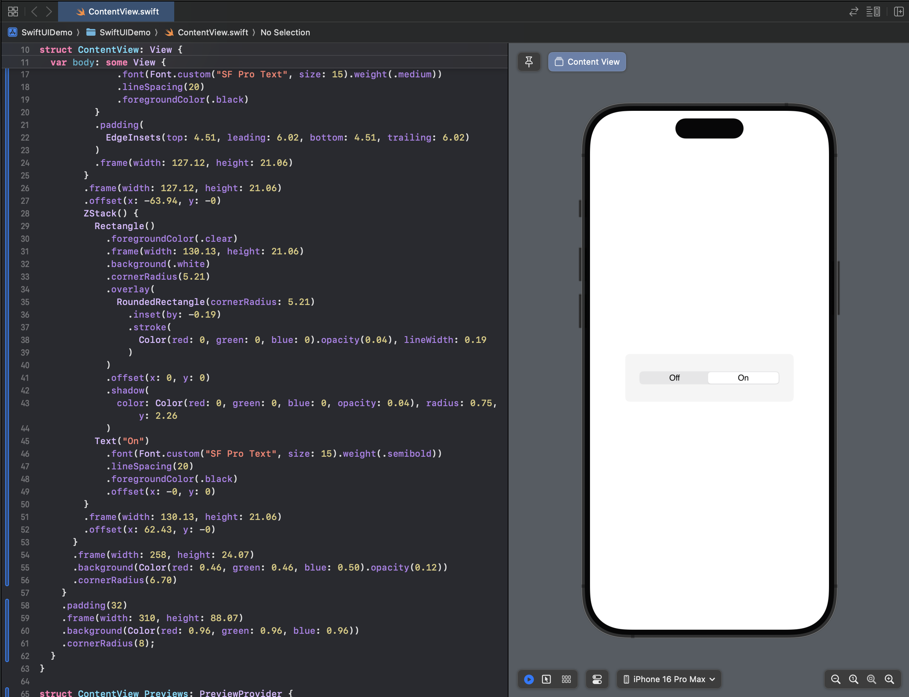

## SwiftUI meet Figma

* Figma에서 기본적으로 제공하는 SwiftUI 코드 Generator가 있으나, 레이아웃 정도 수준으로만 제공
* SwiftUI Input Kit Template을 Figma에서 열기
  * https://www.figma.com/community/tag/swiftui/files
    * https://www.figma.com/community/file/864234074226183072/swiftui-input-kit
* 조금 쓸만하게 쓰려면 별도로 플러그인 설치 필요
  * https://www.figma.com/community/tag/swiftui/plugins
    * https://www.figma.com/community/plugin/842128343887142055/figma-to-code-html-tailwind-flutter-swiftui

### Figma에서 UI Tempate Item을 SwiftUI 코드로 생성

### 생성된 코드를 Xcode에서 실행해보기

* 실제 iOS App 개발자들은 Figma를 거의 다 활용한다고 함
* 어느정도 수준으로 활용하는지는 추가로 확인하지 못함
* Figma React/Next.js PlugIn을 사용해 본 경험 상 Generated 된 코드를 그대로 사용하기 힘들지 않을까 생각 됨
  * 나중에 이럴바에는 내가 직접 하고 말지...라는 생각이 듬
  * 더군다나, 최근에는 UI Framework 가 잘되어 있음 (물론, Swift가 아니지만)
    * https://ui.shadcn.com/
    * https://www.radix-ui.com/
    * https://www.chakra-ui.com/ 

